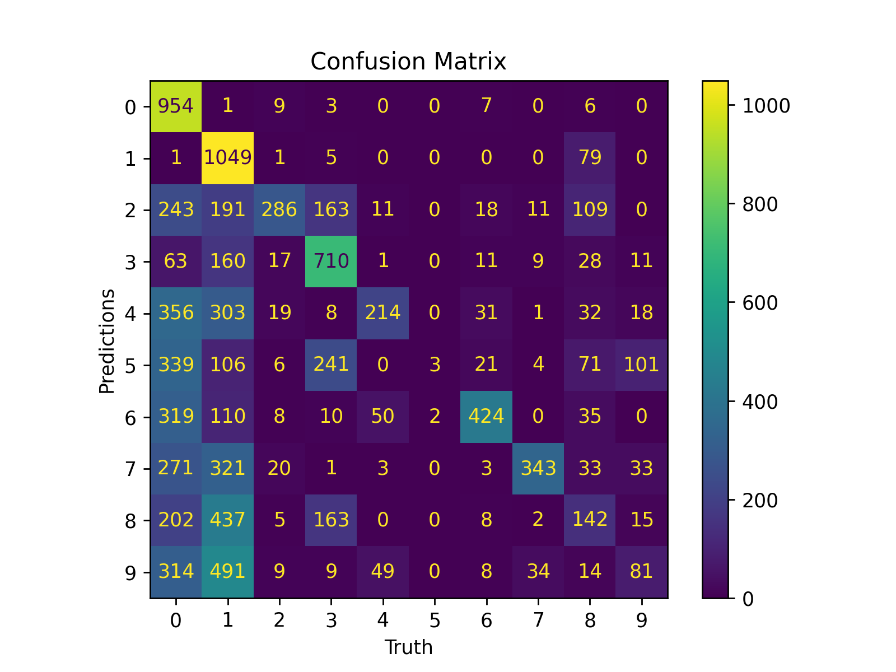
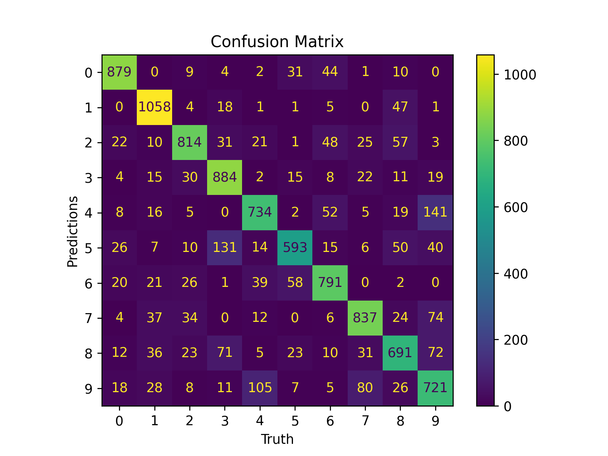
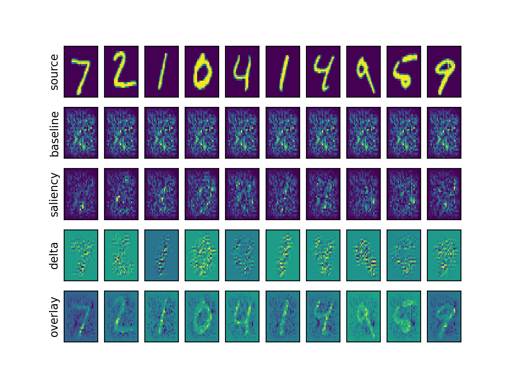
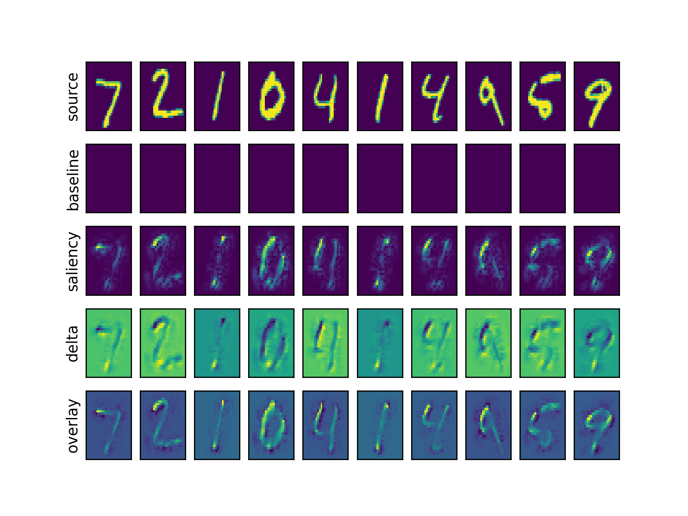
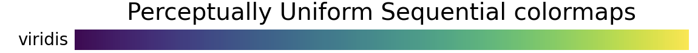

<p align="center">
  <a href="https://github.com/destin-v">
    
  </a>
</p>

# 📒 Description
<p align="center">
  
</p>

<p align="center">
  <a href="https://devguide.python.org/versions/">              </a>
  <a href="https://docs.github.com/en/actions/quickstart">      </a>
  <a href="https://black.readthedocs.io/en/stable/index.html">  </a>
</p>

<p align="center">
  <a href="https://github.com/destin-v/exigo/actions/workflows/pre-commit.yml">  </a>
  <a href="https://destin-v.github.io/exigo/src.html">                           </a>
  <a href="https://github.com/destin-v/exigo/actions/workflows/pytest.yml">      </a>
</p>

Neural networks are difficult to understand because of their ***'black box'*** nature.  Here we will describe various different ways a researcher can interrogate their neural networks to describe what is happening.  This repo contains a pipeline for extracting information from an MNIST dataset.  However, the MNIST pipeline can be replaced with your preferred dataloaders.

# ∮ Running Pipeline
The `runner.py` script has everything you need to get started.  It will:

1) Download the `MNIST` dataset
2) Train a model on `MNIST`
3) Generate plots:
    * confusion matricies
    * saliency plots
    * projection embeddings
4) Save off the best model

Files will be saved the `save` folder.  You can also exercise the full pipeline via `pytest`.

Example of one training epoch:

```console
Global step: 0
training ━━━━━━━━━━━━━━━━━━━━━━━━━━━━━━━━━━━━━━━━ 100% 0:00:21
evaluation ━━━━━━━━━━━━━━━━━━━━━━━━━━━━━━━━━━━━━━━━ 100% 0:00:02
Epoch:               0/2
    Training   Loss: 2.285
    Evaluation Loss: 2.198
```
# 🤔 Confusion Matrix

Confusion matricies are designed to show how well a models' predictions performed.  There are two variables of interest when examining a confusion matrix: ***precision*** and ***recall***.  Each variable can be extracted from a confusion matrix to determine how well a network properly classifies data into separate categories.

*  **precision** = $\Large\frac{p}{\sum{p_{all}}}$

* **recall** = $\Large\frac{p}{\sum{t}}$

  Where:
    * $p$: is correct predictions
    * $p_{all}$: is the total of all predictions made for that class
    * $t$: is the true labels for that class

  Precision is the percentage of predictions that were correct divided by the total number of predictions.  Recall is the percentage of correct predictions divided by the total number of true positives.

<figure>
    <p align="center">
    
    </p>
</figure>

<p align="center">
<b>Figure 1: Confusion matrix at epoch=0</b>
</p>

<figure>
    <p align="center">
    
    </p>
</figure>

<p align="center">
<b>Figure 2: Confusion matrix at epoch=1</b>
</p>

# 🗺️ Saliency Maps
Saliency maps help a designer understand what parts of a an input space contributed toward the decision making process.  In order to build a saliency you need to find the backpropagation gradients with respect to:

  * $x$ -> $y$
  * $x_{baseline}$ -> $y_{baseline}$

  The gradients of $x$ tell you where the network focused on when given the **true label**.  The gradients of $x_{baseline}$ tell you where the network focused on when given **no label**.  This is important because you only want to measure the focus of the network above the **baseline value**.  This is calculated as:

  * $\Delta$ = $x_{gradient}$ - $x_{baseline\ gradient}$


Finally you can multiply the $\Delta$ with the original source image $x$ to determine where the network focused on during a forward pass.  The areas with higher values are more relevant toward the decision process.

The following images are generated:

* **source:**  Shows the source image.
* **baseline:**  Shows where the neural network focuses attention with an empty image.
* **saliency:**  Shows the activations where the network is focused on for the source image.
* **delta:**  Shows the delta which is the saliency minus the baseline noise.
* **overlay:**  Shows saliency multiplied versus the source.  This is what the neural network is focusing on when performing its inference function!


<figure>
    <p align="center">
    
    </p>
</figure>

<p align="center">
<b>Figure 3: Saliency map before training. Epoch=0.</b>
</p>

<figure>
    <p align="center">
    
    </p>
</figure>

<p align="center">
<b>Figure 4: Saliency map after 2 epoch of training.</b>
</p>

<figure>
    <p align="center">
    
    </p>
</figure>


# 📽️ Projection Embeddings

A neural network will cluster data in high dimensional space during training.  However, humans cannot visualize high dimensional data.  We need it to be projected down into three dimensions or lower.  This is where `t-SNE` is helpful.

The general idea with `t-SNE` is that we want to create a lower level projection of the data that matches as closely as possible with the original dimensionality of the data.  To create the data points for `t-SNE`, a set of $x$ inputs is passed through a neural network to output the corresponding $y$ embeddings.  These $y$ embeddings represent a point in high dimensional space.

`t-SNE` uses the ***t-distribution*** to measure the statistical distance between a $y$ data point with respect to every other $y$ data point.  The distance calculation is basically the ***symmetrical KL divergence***.  When projecting from high dimensions to low dimensions, the solver tries to ensure that the relationship between the $y$ data points are preserved.  This is how clusters emerge when using `t-SNE`.  Data points that are close to each other in high dimensions are shown close together in low dimension.

When `t-SNE` projects high dimensional data to a lower dimension it uses an iterative solver that performs the following:

```algorithm
1) Randomly project high dimension points to lower dimension
2) Loop:
    * Iteratively move data points in the lower dimension to match their distances in high dimensions.
```

A complete explaination can be found [**`video`**](https://www.youtube.com/watch?v=NEaUSP4YerM).

After running the pipeline execute the following to see `t-SNE` in action:
```console
tensorboard --logdir=save/logs
```

Under the `projector` tab you will find the visualization tools.  You must use the `Chrome` browser for this to work.  See example below.

<figure>
    <p align="center">
    
    </p>
</figure>

<p align="center">
<b>Figure 5:  t-SNE of embeddings.</b>
</p>

# 🧭 Website Documentation

To generate the HTML execute the following:

```console
nox -r -s autodoc
```

# 🖋️ Authors
William Li

# ✨ References
* Simonyan, K., Vedaldi, A., & Zisserman, A. (2013). Deep inside convolutional networks: visualising image classification models and saliency maps. International Conference on Learning Representations. https://www.robots.ox.ac.uk/~vgg/publications/2014/Simonyan14a/simonyan14a.pdf

* Zeiler, M. D., & Fergus, R. (2014). Visualizing and understanding convolutional networks. In Lecture Notes in Computer Science (pp. 818–833). https://doi.org/10.1007/978-3-319-10590-1_53

* Starter, J. (2017, September 18). StatQuest: T-sne, clearly explained. YouTube. https://www.youtube.com/watch?v=NEaUSP4YerM

* Laurens Van Der Maaten, & Hinton, G. (2008). Visualizing Data using t-SNE. Journal of Machine Learning Research, 9, 2579–2605. https://lvdmaaten.github.io/publications/papers/JMLR_2008.pdf
‌
* Olah, C., Satyanarayan, A., Johnson, I., Carter, S., Schubert, L., Ye, K., & Mordvintsev, A. (2018). The building blocks of interpretability. Distill, 3(3). https://doi.org/10.23915/distill.00010

* Hilton, J., Cammarata, N., Carter, S., Goh, G., & Olah, C. (2020). Understanding RL vision. Distill, 5(11). https://doi.org/10.23915/distill.00029

* Visualizing Representations: Deep Learning and Human Beings - colah’s blog. (n.d.). http://colah.github.io/posts/2015-01-Visualizing-Representations/
